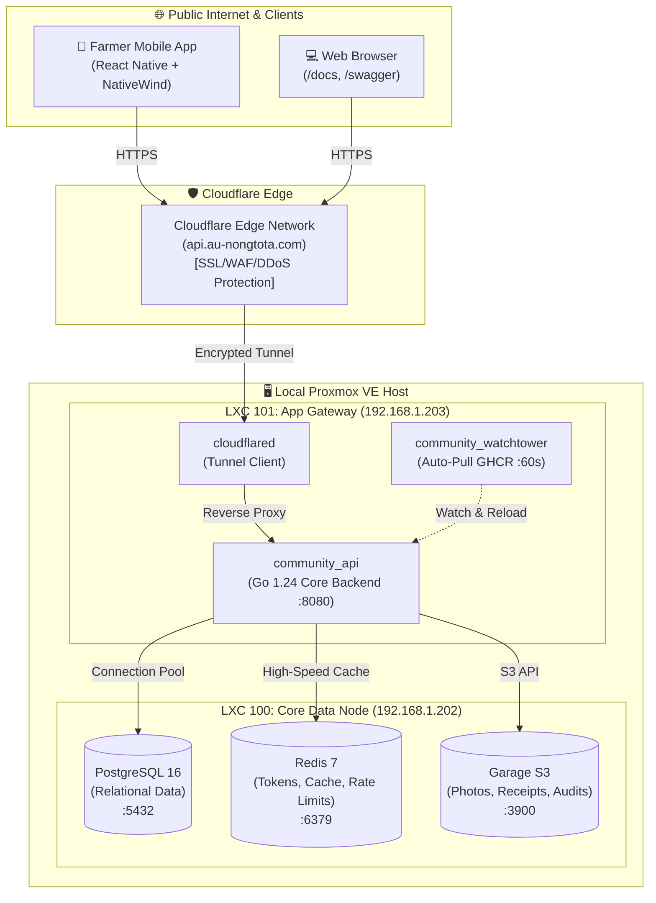

# 🌿 Farm Community & GAP Digital Certificate Platform
> **Backend API Gateway & Core Microservices** สำหรับแพลตฟอร์มชุมชนชาวสวน และระบบตรวจสอบย้อนกลับมาตรฐาน GAP (มกษ. 9001)

[](https://golang.org)
[](https://github.com/ONE-DURIAN/backend/pkgs/container/backend)
[](https://github.com/ONE-DURIAN/backend/actions)
[](https://api.au-nongtota.com/docs)
[](LICENSE)

---

## 📖 สารบัญ (Table of Contents)
- [ภาพรวมสถาปัตยกรรมระบบ (Architecture Overview)](#-ภาพรวมสถาปัตยกรรมระบบ-architecture-overview)
- [โครงสร้างเครือข่าย Proxmox VE (Network Topology)](#-โครงสร้างเครือข่าย-proxmox-ve-network-topology)
- [เทคโนโลยีหลักที่ใช้ (Tech Stack)](#-เทคโนโลยีหลักที่ใช้-tech-stack)
- [จุดเด่นด้านความปลอดภัยและประสิทธิภาพ (Security & Performance)](#-จุดเด่นด้านความปลอดภัยและประสิทธิภาพ-security--performance)
- [โครงสร้างโค้ด (Clean Architecture Project Structure)](#-โครงสร้างโค้ด-clean-architecture-project-structure)
- [เส้นทาง API (API Endpoints & Documentation)](#-เส้นทาง-api-api-endpoints--documentation)
- [การตั้งค่า Environment Variables](#-การตั้งค่า-environment-variables)
- [คู่มือการติดตั้งและรันระบบ (Setup & Deployment)](#-คู่มือการติดตั้งและรันระบบ-setup--deployment)
  - [1. รันบนเครื่อง Local Development](#1-รันบนเครื่อง-local-development)
  - [2. รันด้วย Docker Compose](#2-รันด้วย-docker-compose)
  - [3. ระบบ CI/CD & Auto Deploy ด้วย Watchtower](#3-ระบบ-cicd--auto-deploy-ด้วย-watchtower)

---

## 🏛️ ภาพรวมสถาปัตยกรรมระบบ (Architecture Overview)

ระบบถูกออกแบบภายใต้หลักการ **Self-Hosted Zero-Cloud Provider Cost** โดยรันอยู่บนคลัสเตอร์ฮาร์ดแวร์ท้องถิ่นผ่าน **Proxmox VE** ร่วมกับ **Cloudflare Zero Trust Tunnel** เพื่อส่งมอบบริการออกสู่สาธารณะอย่างปลอดภัยและมีความเร็ว Latency ต่ำสุดขีด (< 1ms ในเครือข่ายภายใน)



---

## 🌐 โครงสร้างเครือข่าย Proxmox VE (Network Topology)

| โหนด / บริการ | IP แอดเดรส | พอร์ต | หน้าที่หลัก |
| :--- | :--- | :--- | :--- |
| **LXC 100** (Data Node) | `192.168.1.202` | `5432` | PostgreSQL 16 สำหรับเก็บข้อมูลผู้ใช้ แปลงสวน และบันทึก GAP |
| | | `6379` | Redis 7 สำหรับ Rate Limiting และ Token Revocation |
| | | `3900` | Garage Distributed S3 Object Storage (Media / ใบรับรอง GAP) |
| **LXC 101** (App Gateway) | `192.168.1.203` | `8080` | Go API Gateway Microservice |
| | | - | Cloudflare Tunnel Agent (`api.au-nongtota.com`) |
| | | - | Watchtower Agent (ตรวจจับ Docker Image ใหม่บน GHCR ทุก 60 วินาที) |
| **Mesh VPN** | Tailscale | Mesh IP | ช่องทางรีโมตจัดการเซิร์ฟเวอร์แบบส่วนตัว ไม่เปิดพอร์ตสู่สาธารณะ |

---

## 🛠️ เทคโนโลยีหลักที่ใช้ (Tech Stack)

- **Language**: [Go (Golang) 1.24](https://go.dev/) โค้ดคอมไพล์เป็น Static Binary ขนาดเล็ก เริ่มต้นเร็ว กินแรมน้อย (< 30MB)
- **Database**: [PostgreSQL 16](https://www.postgresql.org/) พร้อมส่วนขยาย `pgcrypto` และการจัดดัชนีแบบ Partial Unique Index
- **Cache & Memory Store**: [Redis 7](https://redis.io/)
- **Object Storage**: [Garage S3](https://garagehq.deuxfleurs.fr/) (Distributed S3 Storage ประสิทธิภาพสูงสำหรับ Self-hosted)
- **API Documentation**:
  - [Scalar UI](https://scalar.com/) (`/docs`) — พอร์ทัลเอกสาร API สไตล์โมเดิร์น สวยงาม รวดเร็ว
  - [Swagger UI](https://swagger.io/) (`/swagger`) — หน้าทดสอบ Interactive API มาตรฐาน
  - [Swag CLI](https://github.com/swaggo/swag) — เครื่องมือแปลง Go Annotations เป็น OpenAPI 3.0 อัตโนมัติ
- **Security & Identifiers**:
  - **UUIDv7**: สร้าง ID ตามเวลา (Time-ordered) เพื่อแก้ปัญหา B-Tree Index Fragmentation บน PostgreSQL
  - **JWT (HMAC-SHA256)**: Access Token อายุสั้น พร้อม Refresh Token หมุนเวียนใน Redis
  - **Bcrypt**: การแฮชรหัสผ่านความปลอดภัยสูง
- **CI/CD Pipeline**: GitHub Actions + GitHub Container Registry (GHCR) + Watchtower

---

## 🛡️ จุดเด่นด้านความปลอดภัยและประสิทธิภาพ (Security & Performance)

1. **Panic Recovery & Access Logger**:
   - ดักจับ Runtime Panic ทุกจุด ป้องกันเซิร์ฟเวอร์หลุดการเชื่อมต่อ พร้อมตอบกลับเป็น JSON 500 อย่างเป็นระเบียบ
   - ระบบบันทึก Log แสดง HTTP Method, URL, Status Code, และ Request Latency แบบเรียลไทม์
2. **UUIDv7 Primary Keys**:
   - Primary Key ทุกแถวสร้างด้วย UUIDv7 ฝัง Timestamp ระดับมิลลิวินาที ทำให้เรียงลำดับตามเวลาและบันทึกลง Disk ได้เร็วกว่า UUIDv4 ดั้งเดิมหลายเท่า
3. **Database Cold-Start Retry**:
   - มีระบบ Retry Connection สูงสุด 5 ครั้งพร้อม Backoff ป้องกัน API กลายเป็น Zombie Container เมื่อบูตเครื่องพร้อมกับ PostgreSQL
4. **Soft Delete Friendly (Partial Unique Index)**:
   - เบอร์โทรศัพท์และอีเมลใช้ Partial Unique Index (`WHERE deleted_at IS NULL`) ทำให้ชาวสวนที่ขอลบบัญชีไปแล้ว สามารถกลับมาลงทะเบียนใหม่ได้โดยไม่ติดปัญหา Database Duplicate Key
5. **Redis Rate Limiting with Deadlock Prevention**:
   - ป้องกันการ Brute-force รหัสผ่าน และการยิงถล่ม API
   - ตรวจจับ IP แท้จริงผ่าน Header `CF-Connecting-IP` พร้อมตัดหมายเลขพอร์ตทิ้ง (`net.SplitHostPort`)
   - ป้องกันปัญหา Key ค้างถาวร (ตรวจจับและตั้งเวลาหมดอายุอัตโนมัติหาก `TTL < 0`)
6. **OOM Protection (MaxBytesReader)**:
   - จำกัดขนาด Payload Request Body ไม่เกิน 1MB ป้องกันการโจมตี Memory Exhaustion
7. **Privilege Escalation Protection**:
   - ล็อกการสมัครสมาชิกสาธารณะให้ได้สิทธิ์เฉพาะบทบาท `farmer` (ชาวสวน) เท่านั้น สิทธิ์ `auditor` (ผู้ตรวจประเมิน GAP) และ `admin` ต้องได้รับอนุมัติจากผู้ดูแลระบบเท่านั้น

---

## 📂 โครงสร้างโค้ด (Clean Architecture Project Structure)

```text
backend/
├── cmd/
│   └── api/
│       └── main.go              # Entrypoint หลัก, รวม Routing, DI, Graceful Shutdown
├── config/
│   └── config.go             # โหลด Environment Variables พร้อมระบบตรวจสอบ JWT Secret
├── docs/                     # ไฟล์ OpenAPI/Swagger ที่ Gen มาจาก Swag CLI
│   ├── docs.go
│   ├── swagger.json
│   └── swagger.yaml
├── internal/
│   ├── auth/                 # Authentication & Authorization Domain
│   │   ├── handler.go        # HTTP Handlers (Register, Login, Refresh, Logout, Me)
│   │   ├── middleware.go     # Auth, RBAC, Rate Limiting, IP Resolution Middleware
│   │   ├── repository.go     # Database Queries (PostgreSQL) & Redis Storage
│   │   └── service.go        # Business Logic & JWT Token Generation
│   └── domain/               # Domain Models, Entities, Request/Response DTOs
│       └── user.go
├── pkg/                      # Reusable Shared Packages
│   ├── apidocs/              # ตัวกระจาย Route สำหรับ Scalar และ Swagger UI
│   ├── database/             # PostgreSQL Connection Pool & Auto Migration
│   ├── middleware/           # Panic Recovery, Request Logging, CORS
│   ├── redisclient/          # Redis Connection & Healthcheck
│   ├── response/             # Standard API Response Helper (JSON, Error, Success)
│   ├── s3client/             # Garage S3 Client & Bucket Auto-Creation
│   └── uid/                  # ตัวสร้าง UUIDv7 ประสิทธิภาพสูง
├── .github/
│   └── workflows/
│       └── deploy.yml        # CI/CD Workflow บิลด์และ Push ขึ้น GHCR
├── Dockerfile                # Multi-stage Dockerfile ขนาดกะทัดรัด (Alpine)
├── docker-compose.yml        # Compose รวม API + Cloudflared Tunnel + Watchtower
└── README.md
```

---

## 🚀 เส้นทาง API (API Endpoints & Documentation)

สามารถเข้าชมเอกสารประกอบ API แบบ Interactive ได้ที่:
- **Modern Scalar Portal**: [https://api.au-nongtota.com/docs](https://api.au-nongtota.com/docs)
- **Swagger UI**: [https://api.au-nongtota.com/swagger](https://api.au-nongtota.com/swagger)
- **Raw OpenAPI 3.0 JSON**: [https://api.au-nongtota.com/docs/openapi.json](https://api.au-nongtota.com/docs/openapi.json)

### ตารางสรุป Endpoint หลัก

| Method | Endpoint | สิทธิ์เข้าถึง | คำอธิบาย |
| :--- | :--- | :--- | :--- |
| `GET` | `/` | สาธารณะ | ตรวจสอบสถานะและเวอร์ชันระบบ |
| `GET` | `/livez` | สาธารณะ | Liveness Probe สำหรับ Docker / Monitoring (ตอบกลับทันที) |
| `GET` | `/healthz` | สาธารณะ | Deep Readiness Probe วัด Latency ของ DB, Redis, S3 |
| `POST` | `/api/v1/auth/register` | Rate Limit (5 req/min) | สมัครสมาชิกชาวสวน (`farmer`) |
| `POST` | `/api/v1/auth/login` | Rate Limit (10 req/min) | เข้าสู่ระบบ (ด้วยเบอร์โทรหรืออีเมล) |
| `POST` | `/api/v1/auth/refresh` | สาธารณะ | ขอรับ Access Token ชุดใหม่ด้วย Refresh Token |
| `POST` | `/api/v1/auth/logout` | สาธารณะ | ออกจากระบบ และเพิกถอน Token ใน Redis |
| `GET` | `/api/v1/auth/me` | Bearer JWT | ดึงข้อมูลโปรไฟล์ผู้ใช้ปัจจุบัน |

---

## ⚙️ การตั้งค่า Environment Variables

สร้างไฟล์ `.env` ที่โฟลเดอร์ root ของโปรเจกต์:

```env
# แอปพลิเคชัน
APP_PORT=8080

# ฐานข้อมูล PostgreSQL (LXC 100)
DB_HOST=192.168.1.202
DB_PORT=5432
DB_USER=durian_admin
DB_PASSWORD=YOUR_STRONG_DB_PASSWORD
DB_NAME=farm_community

# Redis Cache & Rate Limiting (LXC 100)
REDIS_HOST=192.168.1.202
REDIS_PORT=6379
REDIS_PASSWORD=YOUR_STRONG_REDIS_PASSWORD

# Garage S3 Object Storage (LXC 100)
S3_ENDPOINT=http://192.168.1.202:3900
S3_REGION=garage
S3_ACCESS_KEY=YOUR_GARAGE_ACCESS_KEY
S3_SECRET_KEY=YOUR_GARAGE_SECRET_KEY
S3_BUCKET=community-media

# ความปลอดภัย JSON Web Token (ต้องมีความยาวอย่างน้อย 32 ตัวอักษร)
JWT_SECRET=super_secret_jwt_key_that_is_at_least_32_characters_long
JWT_ACCESS_EXPIRATION_HOURS=2
JWT_REFRESH_EXPIRATION_DAYS=30

# Cloudflare Zero Trust Tunnel
CLOUDFLARE_TUNNEL_TOKEN=YOUR_CLOUDFLARE_TUNNEL_TOKEN
```

---

## 📦 คู่มือการติดตั้งและรันระบบ (Setup & Deployment)

### 1. รันบนเครื่อง Local Development

```bash
# 1. Clone repository
git clone https://github.com/ONE-DURIAN/backend.git
cd backend

# 2. ติดตั้ง Dependencies
go mod download

# 3. อัปเดตเอกสาร API ด้วย Swag CLI
go install github.com/swaggo/swag/cmd/swag@v1.16.4
swag init -g cmd/api/main.go -o docs

# 4. รันระบบ API Gateway
go run ./cmd/api
```

---

### 2. รันด้วย Docker Compose

```bash
# บิลด์และรันทุกเซอร์วิสในแบ็กกราวด์
docker compose up -d --build

# ดูสถานะการทำงาน
docker compose ps

# ดูบันทึกการทำงาน (Log)
docker compose logs -f api
```

---

### 3. ระบบ CI/CD & Auto Deploy ด้วย Watchtower

โปรเจกต์นี้มีระบบส่งมอบซอฟต์แวร์อัตโนมัติ (Automated CI/CD) เต็มรูปแบบ:

1. **เมื่อผลักดันโค้ดขึ้นกิ่ง `main` (`git push origin main`)**:
   - GitHub Actions จะทำการตรวจสอบโค้ด, รัน `swag init` เพื่อสร้างเอกสารล่าสุด
   - บิลด์ Docker Image ผ่าน Native Docker CLI (เป็นไปตามนโยบายความปลอดภัยขององค์กร)
   - ส่ง Image ขึ้น GitHub Container Registry (`ghcr.io/one-durian/backend:latest`)
2. **ฝั่งเซิร์ฟเวอร์ LXC 101**:
   - คอนเทนเนอร์ **Watchtower** จะสแกนหา Image ล่าสุดจาก GHCR ทุกๆ 60 วินาที
   - เมื่อพบการเปลี่ยนแปลง Watchtower จะทำการ Pull และ Graceful Restart เซอร์วิสให้โดยอัตโนมัติโดยที่ผู้ใช้ไม่ได้รับผลกระทบ
3. **คำสั่งตรวจสอบ Watchtower บน LXC 101**:
   ```bash
   # ตรวจสอบการทำงานของ Watchtower
   docker logs -f community_watchtower
   ```

---

## 👥 ผู้พัฒนาและการดูแลรักษา (Maintainers)
- **Team**: ONE-DURIAN Platform Development Team
- **Organization**: ONE-DURIAN
